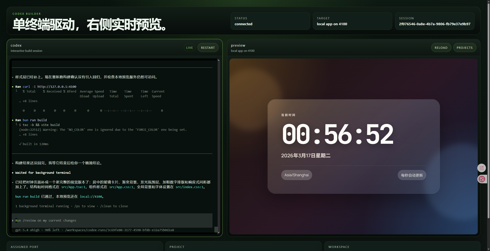

## 核心功能

左侧终端区，留给用户跟 AI 进行交互。

右侧预览区，当 AI 构建好项目之后，会启动运行项目，并且将网页展示在预览区

## 亮点

全过程 AI 完成。 前端测试有 vercel agent-browser ，后端测试直接由 codex 执行 bash 指令。

我全程不参与具体的测试。甚至不需要我去手动点击页面观察页面变化，AI 自己就控制浏览器来完成测试。

## 大致实现思路

"让用户一句话构建应用"这种产品，其实是可以被 codex 这类专业化的 ai coding 工具**覆盖**的。

在有限时间里，一个可用的**最小**方案其实就是：直接让用户跟 codex 交互就行了。

我们要做的只是一些外层封装：

1.让用户可以在网页上访问到终端。终端上运行着 codex 

2.codex 在我们的机器上运行，构建项目，部署到 vercel ，拿到一个 Url。 我们在预览区展示这个 url 内容就行了

## 缺陷自省

1.尚无多租户模式

2.目前用户的交互空间其实是裸露在我们宿主机的。 也就是用户此时访问到的终端，就是当前宿主机终端。用户可以直接执行一些危险指令。

3.codex打包项目到 vercel ，是需要先登录 vercel 账号的，这里用的也是我们自己的 vercel 账号

## 权衡

1.Q:让用户直接访问宿主机怎么行？？？

A：这个其实可以被克服，我们完全可以弄成多租户形式的，然后每个租户分配一个 **sandbox** ，在 sandbox 里面他想执行什么指令都可以。只不过现在还没做而已。

2.Q: 你把自己的 vercel 账号贡献出来给用户用？？？

A:共享 vercel 账号这个问题，也可以被克服。这里要上传到 vercel ，主要就是为了得到一个可访问的链接来做实时预览。目前实时预览的实现访问就是一个 iframe ，里面放什么链接都可以，不一定非得是 vercel.app 。 我们只需要再实现:将任意项目动态部署到我们自己的域名，并且动态按项目分配子域名，也就是达到类似 vercel.app 的效果即可。

3.Q:直接用 codex 提供给用户，这太粗暴了吧，难道不可以用 MetaGPT 来自己造吗？  

A：理论上你想用什么来造都可以，但始终无法绕过一个问题：codex 是最强编程工具，如果你的业务仅仅是"让小白一句话构建 APP"，那这个业务就立即退化为"提供一个在线 AI coding 工具"。 业务本身的护城河不够深，应该仔细思考它是不是一个伪需求。

4.Q: 为什么没有实现多角色 Agent? 

A: 多角色 Agent 真的有用吗? 本来我用一个 Single Codex 就能完成整个项目，为什么要分成多个角色? 如果你真想搞"DeepResearch专家"  "SEO专家"等等这些专家，为什么你不直接编写多个 SKILL， 然后让 codex 去加载就好了？

## 如果给我更多时间，我会实现：

1.仔细思考我们这个产品到底是不是真实需求。 有什么事情是这个产品能做到，而 Codex Web 做不到的吗? 

2.多租户

3.Sandbox

4.类似 Vercel 的即时托管、子域名隔离服务